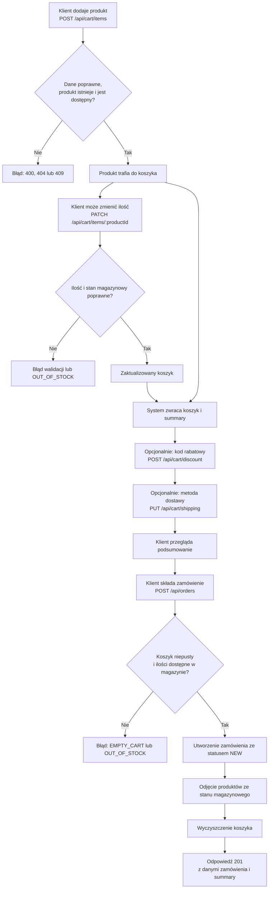

# Przepływ od dodania produktu do złożenia zamówienia

Diagram dotyczy zalogowanego klienta. Operacje koszyka wymagają autoryzacji.

## Reguły do weryfikacji

- **BR-03:** ilość produktu wynosi od 1 do 10 sztuk i nie może przekraczać stanu magazynowego.
- **BR-04–BR-08:** podsumowanie uwzględnia rabat, dostawę i zaokrąglenia kwot.
- **BR-09:** złożone zamówienie otrzymuje status `NEW`.

**MOŻLIWY BŁĄD (BR-03):** w `PATCH /api/cart/items/:productId` kod ogranicza ilość tylko z góry do 10; nie wymusza minimum 1.

## Źródła

- `docs/wymagania.md` — BR-03–BR-09
- `docs/architektura.md` — opis przepływu „złóż zamówienie”
- `docs/api.md` — kontrakty endpointów koszyka i zamówień
- `src/routes/cart.ts` — `cartRouter.post('/items')`, `cartRouter.patch('/items/:productId')`, `cartRouter.post('/discount')`, `cartRouter.put('/shipping')`, `cartView`
- `src/routes/orders.ts` — `ordersRouter.post('/')`
